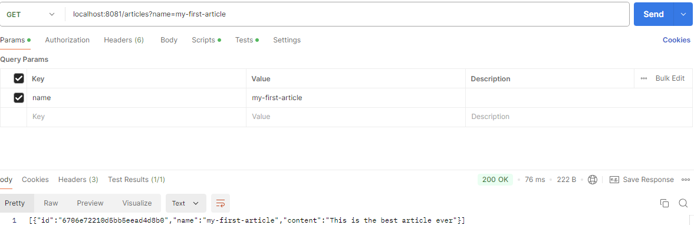
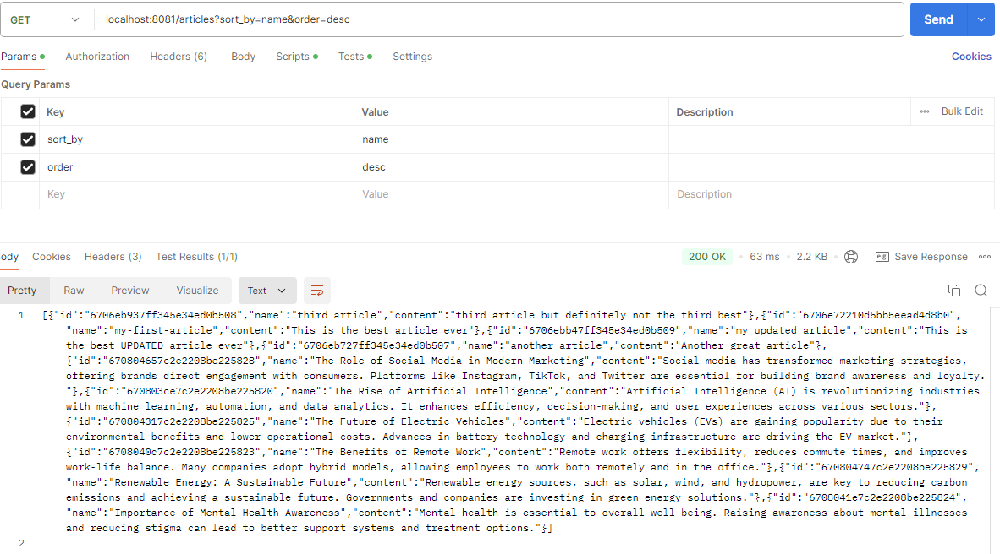
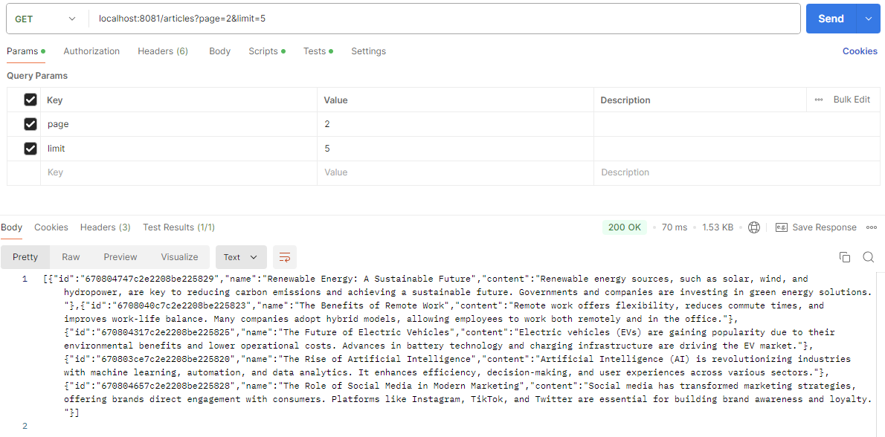

# Go Rest API

## Step 1 - Base

First I followed [the instructions](https://tutorialedge.net/golang/creating-restful-api-with-golang/) building the base for my Rest API.

## Step 2 - MongoDB

I implemented a real database instead of a fake/mock one by adding an env file and modified the code to fetch the data from the actual database.

## Step 3 - Filtering, sorting and pagination

I added filtering, sorting and pagination by modifying the code.

### Filtering

### Sorting

### Pagination

## See changes more specifically

To see the specific changes, see commits.
